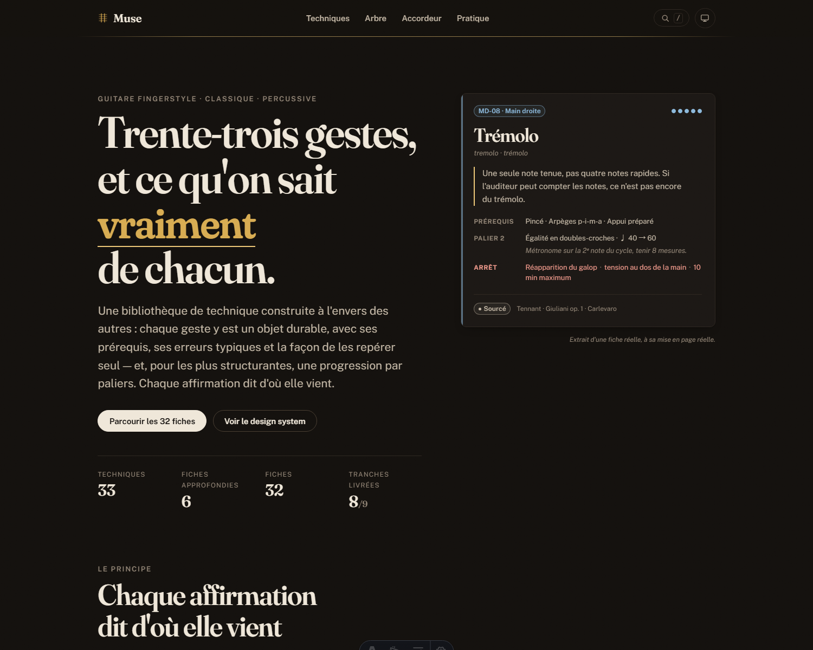
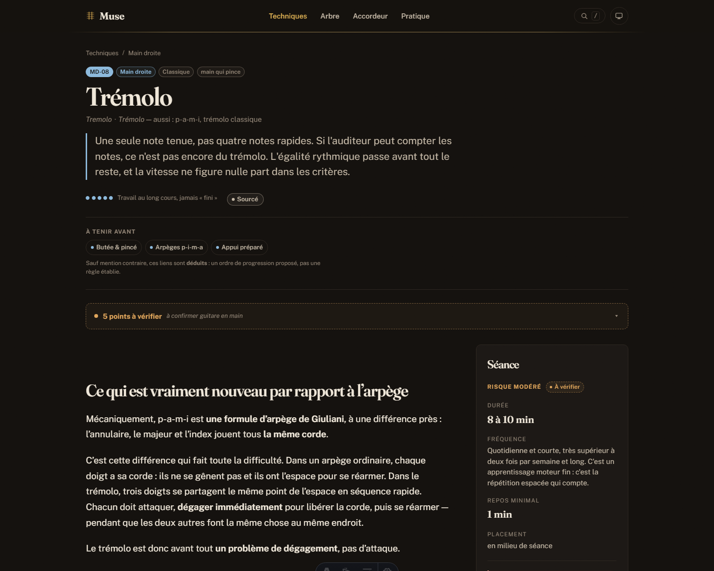
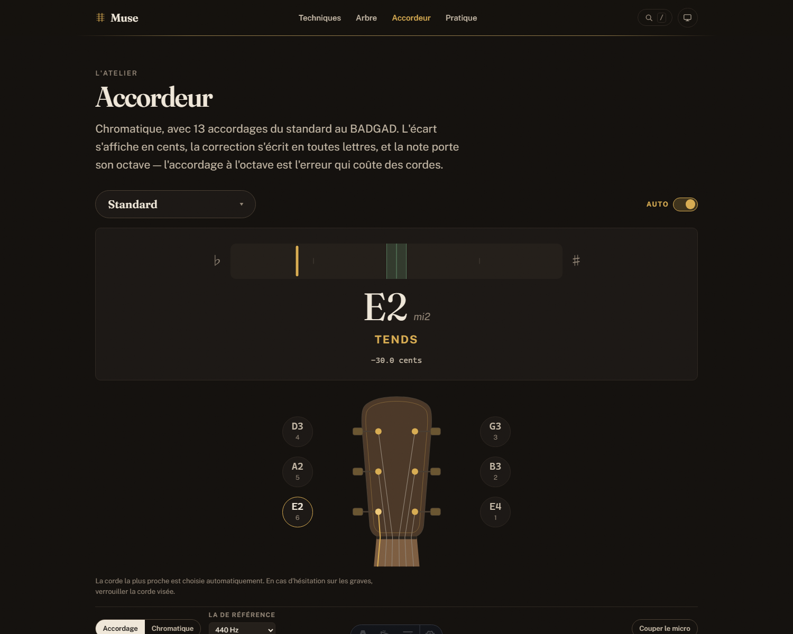

# Muse

Bibliothèque de référence des grandes techniques de guitare **fingerstyle** —
classique et percussif moderne — avec **accordeur chromatique**, arbre de
compétences et atelier de pratique.

Écrite par un praticien, pas par une école. Aucun compte, aucun serveur : tout
ce qui est enregistré vit dans votre navigateur et ressort en JSON.

[](https://github.com/Oopslurp/Oopslurp.github.io/actions/workflows/ci.yml)

Site en ligne : [oopslurp.github.io](https://oopslurp.github.io/)

Prérequis : **Node.js 22.12 ou plus récent** et npm.

```bash
npm ci
npm run dev        # http://localhost:4321
```

Pour vérifier une version de production en local :

```bash
npm run build
npm run preview
```



---

## Ce qui rend ce site différent d'un cours en ligne

**Chaque affirmation dit d'où elle vient.** Trois statuts, visibles à l'écran et
filtrables, jamais en note de bas de page :

| | |
|---|---|
| `sourcé` | attribué à une source identifiée et citée |
| `déduit` | raisonnement mécanique cohérent, qu'aucune source consultée ne formule ainsi |
| `observé` | vérifié guitare en main, avec sa date et sa note |

`observé` est une **promotion manuelle**, par affirmation, qui n'écrase pas
l'origine : « la source affirme ceci, j'ai constaté cela » est l'information
utile. Et les doutes restent écrits — **44 points** portent un `[À VÉRIFIER]`
avec sa raison, dont neuf sur une seule fiche. Ils sont affichés, pas rangés.

> ⚠️ `observé` est enregistré dans **votre** navigateur : vous arrivez donc sur
> un corpus où rien n'est marqué observé, et les vérifications de l'auteur sont
> encore à faire. C'est une limite réelle, expliquée sur la page
> « À propos » du site.

**Les champs santé sont une contrainte de construction.** Une fiche sans durée
maximale, sans signaux d'arrêt ordonnés du plus précoce au plus tardif et sans
repos minimal ne compile pas. Le signal s'affiche près du tempo, là où on décide
de pousser — et le minuteur le **sonne**, parce qu'on travaille en regardant ses
mains.

> Ce site n'est pas un avis médical. Les chiffres cités décrivent des
> populations, plusieurs valeurs santé sont des déductions prudentes faute de
> littérature, et une douleur se porte à un professionnel.

**Aucun nom de note n'est écrit en dur.** Ils sont dérivés en TypeScript depuis
`(accordage, corde, case)`. Deux erreurs sont entrées dans le corpus par cette
voie exacte pendant la phase de recherche : une tablature juste, un nom de note
faux.

---

## Ce qu'il y a dedans

| | |
|---|---|
| `/techniques` | 32 fiches pour 33 techniques, filtrables sur quatre facettes |
| `/techniques/<id>` | fiche : geste, paliers, exercices joués, erreurs, protocole de séance |
| `/arbre` | graphe de prérequis et progression locale |
| `/accordeur` | chromatique, 13 accordages, affiché sur une tête de manche |
| `/pratique` | métronome à motifs, minuteur adossé aux champs santé, journal |
| `/a-propos` | ce que le site est, et ce qu'il n'est pas |

| Une fiche | L'accordeur |
|---|---|
|  |  |

---

## Stack

**Astro** en sortie statique · **content collections** validées par **Zod** ·
**Tailwind 4** sans une seule variante `dark:` · **îlots React** réservés à
l'interactif lourd · **alphaTab** pour la partition, sources en **alphaTex** ·
**pitchy** (McLeod Pitch Method) et Web Audio pour l'accordeur · **Dexie** pour
le local · **TypeScript strict**.

**Aucun CDN, aucune police distante, aucun appel réseau à l'exécution** — et un
audit qui échoue si l'un apparaît.

---

## Vérifier

Un HTML correct ne prouve rien, une page chargée non plus : **ce qui a un
bouton doit être cliqué.** Le lecteur a été livré muet une fois, sans qu'aucun
contrôle ne s'en aperçoive.

```bash
npm test              # notes, accordeur, arbre, journal, sauvegarde, tablatures

npm run audit:console      # exceptions, îlots vides, débordement
npm run audit:lecture      # appuie sur « lire » et vérifie que le curseur avance
npm run audit:accordeur    # joue un mi2 détendu dans un faux micro, lit l'écran
npm run audit:progression  # note une technique, recharge, vérifie qu'elle a tenu
npm run audit:pratique     # compte les oscillateurs réellement programmés
npm run audit:mobile       # 9 routes × 320 et 390 px
npm run audit:poids        # budget par route, aucun appel hors origine
npm run audit:a11y         # contrastes et cibles, sur les couleurs rendues
npm run audit:finitions    # recherche, impression, page introuvable

npm run shot               # captures de contrôle dans .captures/
```

Chacun de ces garde-fous a été **vérifié en échec** avant qu'on lui fasse
confiance : un contrôle qui n'a jamais échoué ne prouve rien. L'intégration
continue les fait tourner à chaque poussée.

---

## Documents

| | |
|---|---|
| [CLAUDE.md](CLAUDE.md) | les décisions qui font foi. En cas de contradiction, il gagne |
| [docs/research/](docs/research/) | la phase de recherche, close |
| [docs/dette.md](docs/dette.md) | ce qui est imparfait, incomplet ou non vérifié |
| [docs/accessibilite.md](docs/accessibilite.md) | relevés d'accessibilité, mesurés et reproductibles |
| [docs/verifications-manuelles.md](docs/verifications-manuelles.md) | ce qu'aucun script ne peut vérifier à ma place |
| [docs/deploiement.md](docs/deploiement.md) | site statique, HTTPS obligatoire |

Ces documents recensent aussi les erreurs trouvées en cours de route. Ils sont
publics pour la même raison que les doutes du corpus le sont.

---

## Contribuer

[CONTRIBUTING.md](CONTRIBUTING.md). Le plus utile : **lever un doute avec une
source**, corriger un doigté, contredire une affirmation `déduit`. Le corpus
affiche ses lacunes précisément pour appeler l'expertise qui lui manque.

## Licences

Code sous [MIT](LICENSE), contenu pédagogique sous
[CC BY-NC-SA 4.0](LICENSE-CONTENU.md). Si vous réutilisez une fiche,
**conservez ses statuts et ses doutes** : une version qui les efface est plus
fausse que l'original, tout en ayant l'air plus sûre.

Voir [LICENCE.md](LICENCE.md) pour ce que le dépôt ne possède pas — citations,
répertoire cité, dépendances servies.

## Crédits

Muse a été développé avec l'assistance de **Claude, par Anthropic**.
La direction éditoriale, les choix techniques et la responsabilité du contenu
restent ceux de Mathieu C.

---

## In English

**Muse** is a French-language reference library for fingerstyle guitar
technique — classical and modern percussive — with a chromatic tuner, a
prerequisite skill tree, and a practice workshop. Static site, no account, no
backend; everything you record stays in your browser and exports to JSON.

Its distinguishing idea is **epistemic status on every claim**: each statement
is marked `sourced`, `derived` (a coherent mechanical inference that no consulted
source actually states), or `observed` (verified with a guitar in hand). Doubts
are displayed with their reasons — 44 of them — rather than smoothed away.
Health fields are a **build constraint**: a technique sheet without a maximum
duration, ordered warning signs and a minimum rest simply does not compile.

Content is in French, with Spanish and English equivalents for technical terms.
This site is not medical advice.
