# 00 — Taxonomie des techniques de guitare fingerstyle / classique

> **Statut** : document de recherche. Aucune décision d'implémentation ici.
> **Cible** : guitariste intermédiaire → expert, fingerstyle classique + fingerstyle moderne percussif.
> **Date de rédaction** : août 2026.

---

## Conventions de lecture

**Latéralité.** Dans tout le corpus, « main droite » (MD) = *main qui pince / frappe*, « main gauche » (MG) = *main qui frette*. C'est la convention des méthodes classiques (Tennant, Carlevaro, Pujol). Si tu joues gaucher, inverse mentalement — le site devra prévoir un flag `handedness` (voir `05-modele-donnees.md`).

**Nomenclature des doigts.**

| Main | Doigt | Symbole | Origine |
|---|---|---|---|
| MD | pouce | **p** | *pulgar* (ES) |
| MD | index | **i** | *índice* |
| MD | majeur | **m** | *medio* |
| MD | annulaire | **a** | *anular* |
| MD | auriculaire | **c** ou **e** ou **ch** | *chico* / *meñique* — usage rare et non standardisé `[À VÉRIFIER]` : Tennant utilise **c**, d'autres sources **e**. À trancher pour le site. |
| MG | index → auriculaire | **1 2 3 4** | — |
| MG | pouce | **T** (rare, fingerstyle acoustique) | thumb-over |

**Difficulté (1–5).** Échelle relative au public visé (intermédiaire → expert), pas au débutant absolu.

| Niveau | Signification |
|---|---|
| 1 | Acquis attendu chez un intermédiaire ; à raffiner, pas à découvrir. |
| 2 | Accessible en quelques séances, la difficulté est la constance. |
| 3 | Plusieurs semaines de travail ciblé. Vrai palier technique. |
| 4 | Plusieurs mois. Demande une progression structurée et du contrôle de tension. |
| 5 | Travail au long cours, jamais « fini ». Niveau concert. |

**Marquage ⭐** = technique traitée en fiche approfondie dans `02-fiches/`.

---

## Famille 1 — Main droite (MD)

| # | Nom (FR) | EN | ES | Diff. | Prérequis | Définition en une phrase |
|---|---|---|---|---|---|---|
| MD-01 | **Butée** ⭐ | rest stroke | *apoyando* | 2 | — | Le doigt traverse la corde et vient se poser (« buter ») sur la corde grave voisine, produisant un son plein et projeté. |
| MD-02 | **Pincé** ⭐ | free stroke | *tirando* | 2 | — | Le doigt traverse la corde et poursuit sa course dans la paume sans toucher la corde voisine : c'est le geste de base de tout jeu polyphonique. |
| MD-03 | **Alternance i-m** | finger alternation | *alternancia* | 2 | MD-01, MD-02 | Alternance stricte de deux doigts (i-m, m-i, ou a-m-i) pour jouer une ligne mélodique rapide sans répéter un doigt. |
| MD-04 | **Arpèges p-i-m-a** ⭐ | arpeggio patterns | *arpegios* | 3 | MD-02, MD-05 | Distribution d'un accord dans le temps, chaque doigt étant affecté à une corde, socle du répertoire classique et de tout accompagnement fingerstyle. |
| MD-05 | **Appui préparé** | planting / preparation | *plantar / apoyo previo* | 3 | MD-02 | Poser le doigt sur la corde *avant* de la pincer, pour contrôler l'attaque et étouffer la note précédente — la clé de la propreté et de la vitesse. |
| MD-06 | **Technique du pouce** | thumb technique | *técnica del pulgar* | 2 | MD-01, MD-02 | Jeu du pouce en pincé ou en butée, articulé depuis l'articulation carpo-métacarpienne, responsable de toute la ligne de basse. |
| MD-07 | **Alternance du pouce** ⭐ | Travis picking / alternating bass | *bajo alternado* | 3 | MD-06, TR-04 | Le pouce marche en croches ou noires régulières sur 2–4 cordes graves pendant que i/m/a jouent la mélodie au-dessus : l'indépendance fondatrice du fingerstyle américain. |
| MD-08 | **Trémolo** ⭐ | tremolo | *trémolo* | 5 | MD-02, MD-04, MD-05 | Répétition ultra-rapide d'une même note aiguë (classiquement p-a-m-i) donnant l'illusion d'une note tenue au-dessus d'une basse arpégée. |
| MD-09 | **Rasgueado** | rasgueado / strum | *rasgueado* | 3 | MD-06 | Déploiement successif des doigts depuis le poing fermé pour un balayage percussif continu, hérité du flamenco. |
| MD-10 | **Harmoniques naturelles** | natural harmonics | *armónicos naturales* | 2 | MD-02 | Effleurement d'une corde à vide au-dessus d'un nœud de vibration (12, 7, 5, 4, 9…) pour n'obtenir qu'un partiel, son cristallin. |
| MD-11 | **Harmoniques artificielles** | artificial / octave harmonics | *armónicos octavados* | 4 | MD-10, MG-01 | L'index MD touche le nœud 12 cases au-dessus de la case frettée pendant que a ou p pince : permet une harmonique sur n'importe quelle note. |
| MD-12 | **Étouffements MD** | right-hand damping / palm mute / pizzicato | *apagado / pizzicato* | 3 | MD-05 | Ensemble des gestes qui *arrêtent* le son : paume sur les basses, doigt reposé, pizzicato sourd près du chevalet. Le silence est une technique. |
| MD-13 | **Tambora** | tambora | *tambora* | 2 | MD-06 | Frappe du côté du pouce (ou du tranchant de la main) sur les cordes près du chevalet, produisant un accord sourd et tambouriné. |

---

## Famille 2 — Main gauche (MG)

| # | Nom (FR) | EN | ES | Diff. | Prérequis | Définition en une phrase |
|---|---|---|---|---|---|---|
| MG-01 | **Placement MG & pouce** | left-hand placement | *colocación de la mano izquierda* | 1 | — | Position neutre du poignet, doigts perpendiculaires, pouce en contrepoids derrière le manche : la condition de tout le reste. |
| MG-02 | **Barré / demi-barré** ⭐ | barre / half barre | *cejilla / media cejilla* | 3 | MG-01 | L'index couche sur plusieurs cordes d'une même case pour faire office de sillet mobile ; le demi-barré n'en couvre que 2 à 4. |
| MG-03 | **Ligado ascendant** | hammer-on | *ligado ascendente* | 2 | MG-01 | Un doigt MG frappe la corde déjà en vibration pour faire sonner une note plus aiguë sans intervention de la MD. |
| MG-04 | **Ligado descendant** | pull-off | *ligado descendente* | 3 | MG-03 | Un doigt MG quitte la corde en la « pinçant » latéralement vers la paume pour faire sonner la note inférieure. |
| MG-05 | **Déplacements & doigts guides** | shifts / guide fingers | *traslados / dedo guía* | 3 | MG-01 | Changement de position le long du manche en conservant un doigt en contact léger comme repère tactile et pivot. |
| MG-06 | **Extensions** | stretches | *extensiones* | 3 | MG-01, MG-05 | Écartement contrôlé entre deux doigts pour couvrir un intervalle large sans déplacer la main, ouverture depuis les MCP et non par torsion du poignet. |
| MG-07 | **Vibrato** | vibrato | *vibrato* | 3 | MG-01 | Oscillation périodique de la hauteur, longitudinale (classique, dans l'axe des cordes) ou latérale (acoustique/électrique, en travers). |
| MG-08 | **Glissando** | slide | *glisando / arrastre* | 2 | MG-05 | Déplacement du doigt le long de la corde en maintenant la pression, faisant entendre le trajet. |
| MG-09 | **Étouffements MG** | left-hand muting | *apagado con la izquierda* | 3 | MG-01, MD-12 | Relâchement partiel ou pose passive d'un doigt pour couper une résonance parasite, indispensable dès qu'on joue en accordage ouvert. |

---

## Famille 3 — Percussif & moderne (PM)

| # | Nom (FR) | EN | ES | Diff. | Prérequis | Définition en une phrase |
|---|---|---|---|---|---|---|
| PM-01 | **Kick / snare / golpe** ⭐ | kick, snare, body hit, golpe | *golpe* | 4 | MD-06, MD-12, TR-03 | Percussions frappées sur la table, l'éclisse ou les cordes pour émuler grosse caisse et caisse claire, intégrées dans le flux fingerstyle. |
| PM-02 | **Nail attack** | nail attack | — | 4 | PM-01, MD-09 | Balayage percussif du dos des ongles (m/a) sur les cordes, signature de Kotaro Oshio, inspiré de Michael Hedges. |
| PM-03 | **Tapping deux mains** | two-handed tapping | *tapping* | 4 | MG-03, MG-04 | Les deux mains frappent des notes sur la touche, libérant la MD de la fonction de pincement. |
| PM-04 | **Harmoniques tapées** | tapped / hammered harmonics | *armónicos golpeados* | 4 | MD-10, MD-11, PM-03 | Un doigt MD frappe perpendiculairement le nœud harmonique (souvent 12 cases au-dessus d'une note frettée) — son de cloche typique de McKee / Dawes. |
| PM-05 | **Accordages alternatifs** | alternate tunings | *afinaciones alternativas* | 2 | MG-09 | Réaccordage de tout ou partie des cordes (DADGAD, open D/G, drop D, CGDGAD…) pour ouvrir des résonances et des doigtés impossibles en standard. |

---

## Famille 4 — Transversal (TR)

Ces éléments ne sont pas des « gestes » isolés mais des dimensions applicables à toutes les techniques. Ils doivent être filtrables séparément sur le site.

| # | Nom (FR) | EN | ES | Diff. | Prérequis | Définition en une phrase |
|---|---|---|---|---|---|---|
| TR-01 | **Dynamiques** | dynamics | *dinámica* | 3 | MD-01, MD-02 | Contrôle continu de l'intensité (ppp → fff) par la profondeur d'enfoncement et la vitesse du doigt, pas par la force brute. |
| TR-02 | **Timbre : sul tasto ↔ ponticello** | tone colour | *dulce / metálico* | 3 | MD-02 | Déplacement du point d'attaque de la MD entre la touche (rond, feutré) et le chevalet (nasal, mordant), plus rotation de l'angle du doigt. |
| TR-03 | **Placement rythmique** | time feel / groove | *ritmo / groove* | 4 | — | Où l'on pose la note dans la subdivision : au centre, devant (*push*), derrière (*laid back*) — ce qui sépare le correct du vivant. |
| TR-04 | **Équilibre des voix** | voicing / balance | *equilibrio de voces* | 4 | MD-02, MD-04 | Faire ressortir la mélodie au-dessus de la basse et de l'accompagnement joués simultanément par la même main. |
| TR-05 | **Relâchement & économie** | release / economy of motion | *relajación* | 4 | — | Rendre au repos chaque muscle immédiatement après son travail ; la compétence la plus décisive pour la vitesse **et** pour la santé de la main. |
| TR-06 | **Ongles** | nails | *uñas* | 2 | — | Forme, longueur, polissage et angle de contact de l'ongle : c'est une partie du geste, pas un accessoire. |

---

## Récapitulatif

| Famille | Entrées | Dont fiches approfondies |
|---|---|---|
| Main droite | 13 | 5 (MD-01+02 fusionnées, MD-04, MD-07, MD-08) |
| Main gauche | 9 | 1 (MG-02) |
| Percussif & moderne | 5 | 1 (PM-01) |
| Transversal | 6 | 0 |
| **Total** | **33** | **6 fiches** |

Les 27 entrées restantes sont traitées en fiches courtes dans `03-fiches-courtes.md`.

---

## Graphe de prérequis

Le graphe est un DAG. Les nœuds transversaux (TR) sont volontairement peu contraints en amont : ils se travaillent *en même temps* que le reste, pas après.

```mermaid
graph TD
    classDef md fill:#e8f0fe,stroke:#4a72c4,color:#12305e
    classDef mg fill:#e9f7ec,stroke:#4a9c5e,color:#11441f
    classDef pm fill:#fdecea,stroke:#c4544a,color:#5e1a14
    classDef tr fill:#fdf3e0,stroke:#c4923f,color:#5e4212
    classDef fiche stroke-width:3px

    %% ---------- Main droite ----------
    MD01["MD-01 Butée<br/>(apoyando) · 2"]
    MD02["MD-02 Pincé<br/>(tirando) · 2"]
    MD03["MD-03 Alternance i-m · 2"]
    MD04["MD-04 Arpèges p-i-m-a · 3"]
    MD05["MD-05 Appui préparé · 3"]
    MD06["MD-06 Pouce · 2"]
    MD07["MD-07 Alternance du pouce · 3"]
    MD08["MD-08 Trémolo · 5"]
    MD09["MD-09 Rasgueado · 3"]
    MD10["MD-10 Harm. naturelles · 2"]
    MD11["MD-11 Harm. artificielles · 4"]
    MD12["MD-12 Étouffements MD · 3"]
    MD13["MD-13 Tambora · 2"]

    %% ---------- Main gauche ----------
    MG01["MG-01 Placement MG · 1"]
    MG02["MG-02 Barré · 3"]
    MG03["MG-03 Ligado asc. · 2"]
    MG04["MG-04 Ligado desc. · 3"]
    MG05["MG-05 Déplacements · 3"]
    MG06["MG-06 Extensions · 3"]
    MG07["MG-07 Vibrato · 3"]
    MG08["MG-08 Glissando · 2"]
    MG09["MG-09 Étouffements MG · 3"]

    %% ---------- Percussif ----------
    PM01["PM-01 Kick/Snare/Golpe · 4"]
    PM02["PM-02 Nail attack · 4"]
    PM03["PM-03 Tapping 2 mains · 4"]
    PM04["PM-04 Harm. tapées · 4"]
    PM05["PM-05 Accordages alt. · 2"]

    %% ---------- Transversal ----------
    TR01["TR-01 Dynamiques · 3"]
    TR02["TR-02 Timbre · 3"]
    TR03["TR-03 Placement rythmique · 4"]
    TR04["TR-04 Équilibre des voix · 4"]
    TR05["TR-05 Relâchement · 4"]
    TR06["TR-06 Ongles · 2"]

    %% ---------- Arêtes MD ----------
    TR06 --> MD01
    TR06 --> MD02
    MD01 --> MD03
    MD02 --> MD03
    MD02 --> MD05
    MD02 --> MD04
    MD05 --> MD04
    MD01 --> MD06
    MD02 --> MD06
    MD06 --> MD07
    TR04 --> MD07
    MD04 --> MD08
    MD05 --> MD08
    MD02 --> MD08
    MD06 --> MD09
    MD06 --> MD13
    MD02 --> MD10
    MD10 --> MD11
    MG01 --> MD11
    MD05 --> MD12

    %% ---------- Arêtes MG ----------
    MG01 --> MG02
    MG01 --> MG03
    MG03 --> MG04
    MG01 --> MG05
    MG05 --> MG06
    MG01 --> MG06
    MG01 --> MG07
    MG05 --> MG08
    MG01 --> MG09
    MD12 --> MG09

    %% ---------- Arêtes percussif ----------
    MD06 --> PM01
    MD12 --> PM01
    TR03 --> PM01
    PM01 --> PM02
    MD09 --> PM02
    MG03 --> PM03
    MG04 --> PM03
    MD10 --> PM04
    MD11 --> PM04
    PM03 --> PM04
    MG09 --> PM05

    %% ---------- Arêtes transversales ----------
    MD01 --> TR01
    MD02 --> TR01
    MD02 --> TR02
    MD02 --> TR04
    MD04 --> TR04

    class MD01,MD02,MD03,MD04,MD05,MD06,MD07,MD08,MD09,MD10,MD11,MD12,MD13 md
    class MG01,MG02,MG03,MG04,MG05,MG06,MG07,MG08,MG09 mg
    class PM01,PM02,PM03,PM04,PM05 pm
    class TR01,TR02,TR03,TR04,TR05,TR06 tr
    class MD01,MD02,MD04,MD07,MD08,MG02,PM01 fiche
```

### Chemins critiques lisibles dans le graphe

1. **Chemin « son »** : `TR-06 Ongles → MD-02 Pincé → TR-01 Dynamiques / TR-02 Timbre`. Rien de sonore ne s'améliore avant que la forme d'ongle et le point de contact soient stables.
2. **Chemin « polyphonie »** : `MD-02 → MD-05 → MD-04 → TR-04 → MD-07 / MD-08`. C'est le tronc du fingerstyle : ni le Travis ni le trémolo ne sont accessibles sans appui préparé propre.
3. **Chemin « percussif »** : `MD-06 + MD-12 + TR-03 → PM-01 → PM-02`. Le kick/snare échoue presque toujours sur l'étouffement (MD-12), pas sur la frappe.

### Nœuds sans prérequis (points d'entrée)

`MG-01`, `TR-03`, `TR-05`, `TR-06`. Ce sont les quatre choses à travailler dès aujourd'hui, en parallèle du reste.

> **Note sur TR-05 (relâchement)** : dans le graphe je l'ai laissé sans arête sortante pour éviter de connecter 30 nœuds. Dans les données du site, il devra être marqué comme *transversal obligatoire* et affiché en bandeau sur chaque fiche plutôt que comme un prérequis classique. Voir `05-modele-donnees.md`, champ `alwaysApplies`.

---

## Sources de la taxonomie

- **Scott Tennant**, *Pumping Nylon: The Classical Guitarist's Technique Handbook* (Alfred, 1re éd. 1995, éd. révisée avec audio en ligne). Structure MD/MG, vocabulaire apoyando/tirando, « Daily Warm-Up Routine » en 11 exercices, chapitres sur les ongles et le trémolo. [Notice éditeur](https://www.amazon.com/Pumping-Nylon-Classical-Guitarists-Technique/dp/1470631385) · [Présentation par This Is Classical Guitar](https://www.thisisclassicalguitar.com/pumping-nylon-scott-tennant/) · [Exemplaire consultable, Internet Archive](https://archive.org/details/pumpingnylonclas0000tenn)
- **Abel Carlevaro**, *Escuela de la Guitarra: Exposición de la Teoría Instrumental* (1979) + *Serie Didáctica para Guitarra*, cahiers 1 à 4 (n°1 gammes diatoniques, n°2 technique MD, n°3 et 4 technique MG). Source de la notion de *toques* (types d'attaque) et de la classification des mouvements par articulation. [Fiche Cuadernos 1-4, Strings By Mail](https://www.stringsbymail.com/carlevaro-cuadernos-didactic-series-for-solo-guitar-1-4-18205.html) · [Cuaderno n°2, technique MD](https://www.stringsbymail.com/carlevaro-serie-didactica-no-2-right-hand-technique-for-solo-guitar-7055.html) · [Notice School of Guitar, cglib.org](https://www.cglib.org/abel-carlevaro-school-of-guitar-exposition-of-instrumental-theory/) · [Abel Carlevaro, Wikipédia EN](https://en.wikipedia.org/wiki/Abel_Carlevaro)
- **Golpe** — définition et geste (frappe du majeur ou de l'annulaire sur le *golpeador*, simultanée à un coup vers le bas ou indépendante pour accentuer les contretemps) : [Golpe (guitar technique), Wikipédia EN](https://en.wikipedia.org/wiki/Golpe_(guitar_technique))
- **Kotaro Oshio / nail attack** — description du geste (frappe des cordes avec les ongles du majeur et de l'annulaire, inspiration Michael Hedges, superposition percussion + mélodie) : [Acoustic Accent, « Kotaro Oshio — fingerstyle perfection and… NAIL ATTACK! »](https://acousticaccent.wordpress.com/2015/11/05/kotaro-oshio-fingerstyle-perfection-and-nail-attack/) · [Kotaro Oshio, Wikipédia EN](https://en.wikipedia.org/wiki/Kotaro_Oshio)
- **Mike Dawes** — inventaire des techniques percussives enseignées (six sons percussifs distincts, frappe des cordes graves à l'ongle + paume sur la caisse pour le kick, slap des six cordes pour la caisse claire, side slaps, harmoniques martelées, tapping d'accords, polymétrie) : [JamPlay, Fingerstyle Mastery, 40 leçons](https://jamplay.com/guitar-lessons/artists/316-mike-dawes) · [TrueFire, Progressive Fingerstyle: Essential Riffs](https://truefire.com/mike-dawes-guitar-lessons/progressive-fingerstyle-essential-riffs/c1841)
- **Acoustic Guitar Magazine**, « Learn These Percussive Fingerstyle Guitar Techniques to Add Punch and Groove to Your Playing » — description du slap main droite frappée vers la table produisant le claquement des cordes contre les frettes. [Article](https://acousticguitar.com/learn-these-percussive-fingerstyle-guitar-techniques-to-add-punch-and-groove-to-your-playing/)

---

## `[À VÉRIFIER]` de ce document

| Point | Raison du doute |
|---|---|
| Symbole du 5e doigt MD (**c** / **e** / **ch**) | Trois usages coexistent selon les écoles ; je n'ai pas de source primaire consultée pour trancher. Sans importance pratique mais il faut choisir une convention et s'y tenir sur le site. |
| Attribution des difficultés 1–5 | Ce sont **mes estimations**, calibrées sur un profil intermédiaire → expert, pas des valeurs issues d'un référentiel publié. À réviser après quelques semaines d'usage réel. |
| Prérequis `TR-03 → PM-01` | Discutable : on peut argumenter qu'on apprend le placement rythmique *par* la percussion plutôt que l'inverse. Je l'ai mis en amont parce qu'une frappe mal placée dans le temps est inutilisable, mais c'est un choix pédagogique, pas un fait. |
| `MD-13 Tambora` classée en MD et non en percussif | La tambora est un geste percussif mais issu du répertoire classique/latino (Barrios, Lauro) et exécuté par la main de pince ; je l'ai laissée en MD. Reclassable. |
